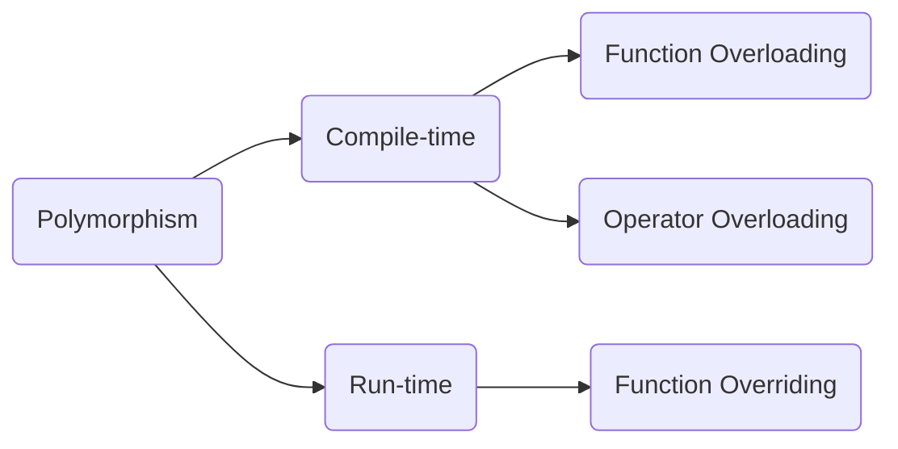

## Operator Overloading (copy)
```cpp
class Mystring {
	friend bool operator==(const Mystring &lhs, const Mystring &rhs); // compare
	friend Mystring operator-(const Mystring &obj); // -str
	friend Mystring operator+(const Mystring &lhs, const Mystring &rhs); // concat

	friend std::ostream &operator<<(std::ostream &os, const Mystring &rhs); // stream insertion
	friend std::istream &operator>>(std::istream &in, Mystring &rhs); // stream extraction
private:
	char *str;
public:
	Mystring();
	Mystring(const char *s);
	Mystring(const Mystring &source);
	~Mystring();

	Mystring &operator=(const Mystring &rhs);

	void display() const;
	int get_length() const;
	const char *get_str(); const;
}
```

```cpp
Mystring &Mystring::operator=(const Mystring &rhs) {
	if (this == &rhs)
		return *this;
		    
	delete [] str;
	str = new char[std::strlen(rhs.str) + 1];
	std::strcpy(str, rhs.str);
		
	return *this; // to chain s1 = s2 = s3
}
```
## Operator Overloading (move)
```cpp
s1 = Mystring {"Joe"}; //move operator called

Mystring &Mystring::operator=(Mystring &&rhs) {
	if (this == &rhs)
		return *this;
		
	delete [] str;
	str = rhs.str;
	rhs.str = nullptr;
	
	return *this;
}
```

# Inheritance

## Basics
```cpp
class Account {
public:
	double balance;
	std::string account_name;
	void deposit(double amount);
	void withdraw(double amount);
	Account();
	~Account();
}

class SavingAccount: public Account {
public:
	double int_rate;
	void deposit(double amount) { Account::deposit(amount); } // override
	SavingAccount() : Account{} {} // call parent constructor
}
``` 
## Multiple Inheritance
```cpp
class DepartmentChair: public Faculty, public Administrator {
	...
};
```

# Polymorphism



## Static Binding
```cpp
class Base {
public:
	void say_hello() const {
		std::cout << "Base Class" << std::endl;
	}	
};

class Derived: public Base {
public:
	void say_hello() const {
		std::cout << "Derived Class" << std::endl;
	}
};

void greetings(const Base &obj) {
	obj.say_hello();
};

int main() {
	Derived d;
	greetings(d); // outputs "Base Class"
	
	Base *ptr = new Derived();  
	ptr->say_hello(); // outputs "Base Class"
	
	delete ptr; // always delete pointer
	
	// with a smart pointer
	// include <memory>

	std::unique_ptr<Base> ptr1 = std::make_unique<Derived>();  
	ptr1->say_hello(); // outputs "Base Class"
	
	return 0;
}
```

## Dynamic Polymorphism
* For dynamic polimorphism we must have 
	* Inheritance
	* Base class pointer or Base class reference
	* Virtual functions


```cpp
class Account {
public:
	virtual void withdraw(double amount);
}

class Savings: public Account{
public:
	virtual void withdraw(double amount); // best practice to make it virtual again
}
```

```cpp
Account *p1 = new Savings();
p1->withdraw(1000); // Savings::withdraw
delete p1;
```
```cpp
Account *p1 = new Savings();
Account *p2 = new Trust();

vector<Account *> accounts {p1, p2};

for (auto acc_ptr: accounts) {
	acc_ptr->withdraw(1000);
}
//delete pointers
```
```cpp
// using class references
Savings s;
Account &ref1 = s;
ref1.withdraw(1000); // Savings::withdraw
```

## Virtual Destructors
* if a class has virtual functions
* ALWAYS provide a public virtual destructor
* if base class destructor is virtual then all derived class destructors are also virtual

## Override Specifier
* Add override at the end of the function if you override the base class functions so compiler will warn you if you didn't match the overridden function

```cpp
class Savings: public Account{
public:
	virtual void withdraw(double amount) override; 
}
```

## The final specifier
 * **when used at the class level**
 * prevents a class from being derived from
 * **when used at the method level**
 * prevents virtual method from being overridden in derived classes

## Pure virtual functions
* Abstract class
	* Cannot instantiate objects
	* These classes are used as base classes in inheritance hierarchies
	* Often referred to as Abstract Base Classes
	* Contains at least one pure virtual function
	* Concrete classes must override pure virtual functions, if not Base class becomes also abstract
```cpp
virtual void function() = 0; // pure virtual function
```
## Interface
an abstract class that has only pure virtual functions. c++ doesnt have interface keyword so we achive that by making abstract classes all functions pure virtual
```cpp
class I_Printable {  
    friend ostream &operator<<(ostream &os, const I_Printable &obj);  
public:  
    virtual void print(ostream &os) const = 0;  
};  
  
ostream &operator<<(ostream &os, const I_Printable &obj) {  
    obj.print(os);  
    return os;  
}  
  
class Test: public I_Printable {  
public:  
    void print(ostream &os) const override {  
        os << "Hi from Test";  
    }  
};  
  
void pprint(I_Printable &t) {  
    cout << t << endl;  
}  
  
int main() {  
    Test *t = new Test();  
    pprint(*t);  
  
    delete t;  
  
    return 0;  
  
}
```
# Smart Pointers
Smart pointers are objects, can only point to heap-allocated memory, auto delete, created from template library, pointer arithmetic (++, --, etc) is not supported
* Unique pointers
* Shared pointers
* Weak pointers
* Auto pointers (deprecated)
```cpp
#include <memory>

std::unique_ptr<Base> ptr = std::make_unique<Class>();  
ptr->method();
cout << (*ptr) << endl;
```
RAII -> Resource Acquisition Is Initialization
* common software design pattern
* RAII objects are allocated on the stack
* Resource Acquisition
	* Open a file
	* Allocate memory
	* Acquire a lock
* Is Initialization
	* The resource is acquired in a constructor

## Unique Pointers
* simple smart pointer very  efficient!
* *unique_ptr \<T>*
	* points to an object of type T on the heap
	* there can only be one unique_ptr\<T> pointing to the object on the heap
	* Owns what it points to
	* can not be assigned or copied
	* can be moved
	* when pointer is destroyed, what it points to is automatically destroyed
```cpp
std::unique_ptr<int> p1 {new int {100}};
*p1 = 200;
p1.get(); // 0x412312
p1.reset(); // p1 is now nullptr

std::unique_ptr<int> p1 {new Account("Larry")};

std::vector<std::unique_ptr<int>> vec;
std::unique_ptr<int> ptr {new int {100}};
vec.push_back(ptr); // Error: copy not allowed
vec.push_back(std::move(ptr)); // ok

//more efficient methods
std::unique_ptr<int> p1 = make_unique<int>(100);
std::unique_ptr<Account> p2 = make_unique<Account>("Larry", 1000);
auto p3 = make_unique<Player>("Larry", 2000);
```
## Shared Pointers
* provides shared ownership of heap objects
* *shared_ptr \<T>*
	* points to an object of type T on the heap
	* there can be many shared_ptrs pointing the same object on the heap
	* establishes shared ownership relationship
	* can be assigned and copied
	* can be moved
	* doesn't support managing arrays by default
	* when the use count is zero, the managed object on the heap is destroyed ( *use_count()* )

## Weak pointers
* provides a non-owning *"weak"* reference
* *weak_ptr \<T>*
	* points to an object of type T on the heap
	* does not participate in owning relationship
	* Always created from a *shared_ptr*
	* does not increment or decrement reference use_count
	* used to prevent strong reference cycles which could **prevent objects from being deleted**

## Custom Deleters
* if you want use custom deleter you can not use make_unique or make_shared
```cpp
void my_deleter (Account *raw_pointer) {
	// do some stuff here
	delete row_pointer;
}

shared_ptr<Account> ptr {new Account {}, my_deleter };

// using lambda
shared_ptr<Account> ptr (new Account {}, [] (Account *ptr) {
	// do some stuff here
	delete ptr;
});
```

# Exceptions
## Basics
```cpp
double average {};
try {
	if (total == 0)
		throw 0;
	average = sum / total;
} catch (int &ex) {
	std::cerr << "can't divide by zero" << std::endl;
} catch (...) { // catches all exceptions in case type different from handled
	std::cout << "unknown error" << std::endl;
}
```
## Throwing an Exception from a Function
```cpp
double calculate_avg(int sum, int total) {
	if (total == 0)
		throw 0;
	return static_cast<double>(sum) / total;
}
```
## Stack unwinding
c++ try to find try except block in chain of called function stacked
main try catch -> func a -> func b -> func c (throws exception) 
in this case exception will be catched on main. this is stack unwinding

## User Defined Exception Class
```cpp
class DivideByZeroException {}

if (total == 0) 
	throw DivideByZeroException();

try {} catch (const DivideByZeroException &ex) { ... }
```

## Class level exceptions
Exceptions can also be thrown from within a class
* Method
	* These work the same way like above
* Constructor
	* an exception can be thrown from constructor if initializations fails
* Destructor
	* do **NOT** throw exceptions from destructor

## The C++ std::exception Class Hierarchy
*	C++ provides a class hierarchy of exception classes
	*	strd::exception is the base class
	*	all subclasses implement the *what()* virtual function
	*	we can create our own user-defined ception subclasses

```cpp
virtual const char *what() const noexcept;
```
```cpp
class IllegalBalanceException: public std::exception {  
public:  
    IllegalBalanceException() noexcept = default;  // no except means i will not throw an exception
    ~IllegalBalanceException() override = default;  
      
    [[nodiscard]] const char* what() const noexcept override {  
        return "Illegal balance exception";  
    }  
};
```
# I/O and Streams
## Common Header Files
| Header File | Description                                                            |
|-------------|------------------------------------------------------------------------|
|*iostream*   |Provides definitions for formatted input and output from/to streams     |
|*fstream*    |Provides definitions for formatted input and output from/to file streams|
|*iomanip*    |Provides definitions for manipulators used to format stream I/O         |

## Commonly used stream classes
|Class         |Description                                                        |
|--------------|-------------------------------------------------------------------|
|*ios*         |Provides basic support for formatted and unformatted I/O operations|
|*ifstream*    |Provides for high-level input operations on file based streams     |
|*ofstream*    |Provides for high-level output operations on file based streams    |
|*fstream*     |Provides for high-level I/O operations on file based streams       |
|*stringstream*|Provides for high-level I/O operations on memory based strings     |

## Stream Manipulators
|Manipulator|Description|
|--|--|
|**booleans**||
|std::boolalpha|will display true|
|std::noboolalpha|will display 1,0 (default)|
|**integers**||
|std::dec,hex,oct|base10|
|std::noshowbase|prefix used to show hexadecimal or octal|
|std::nouppercase|when displaying a prefix and hex values it will be lowercase|
|std::noshowpos|no '+' is displayed for positive numbers|
|**float**||
|std::setprecision|number of digits displayed(6)|
|std::fixed|not fixed to a specific number of digits after the decimal point|
|std::noshowpoint|trailing zeroes are not displayed|
|std::nouppercase|when displaying in scientific notation|
|std::noshowpos|no '+' is displayed for positive numbers|
|**align, fill**||
|std::setw|not set by default|
|std::left|when no field width, right - when using field width|
|std::fill|not set by default - blank space is used|

## Reading from file
```cpp
#include <iostream>  
#include <fstream>  
#include <iomanip>  
  
int main() {  
    std::ifstream in_file;  
    std::string name;  
    int num;  
    double total;  
  
    in_file.open("../murat.txt");  
    if (!in_file) {  
        std::cerr << "Error opening file!" << std::endl;  
        return 1;  
    }  
  
    while (!in_file.eof()) {  
	    // std::string line {};  
		// std::get_line(in_file, line)  
		
		// char c {}; 
		// in_file.get(c);  
		
		in_file >> name >> num >> total;  
		std::cout << std::setw(10) << std::left << name  
                << std::setw(10) << num  
                << std::setw(10) << total  
                << std::endl;  
    }  
    in_file.close();  
    return 0;  
}
```

## Writing to a file
```cpp
#include  <iostream>
#include  <fstream>
#include  <iomanip>

int  main() {
	std::ofstream out_file {"../output.txt"}; // to append std::ios::app as second parameter

	if (!out_file) {
	std::cerr <<  "Error creating file!"  <<  std::endl;
	return  1;
	}

	std::string line {"Murasaki Shikibu - The Tale of Genji\n"};
	out_file  <<  line;
	out_file.close();
	return  0;
}
```

## Reading from a stringstream
```cpp
#include  <iostream>
#include  <sstream>

  

int  main() {
	int  num {};
	double  total {};
	std::string str {};
	std::string info {"Moe 100 1234.5"};

	std::istringstream iss {info};
	iss  >>  str  >>  num  >>  total;
}
```

## Writin to a stringstream
```cpp
#include  <iostream>
#include  <sstream>

int  main() {
	int  num {100};
	double  total {1234.5};
	std::string info {"Moe"};

	std::ostringstream oss {};
	oss  << name <<  " "  <<  num  <<  " "  <<  total;
	std::cout <<  oss.str() <<  std::endl;
}
```

# The Standard Template Library (STL)

## Macro (do not use unless it is a legacy code)
```cpp
#define SQRT(a) ((a) * (a))
result = SQRT(5); // ((5) * (5))
result = 100/SQRT(5); // 100 / ((5) * (5)) = 4
```

## Function & Class Templates
```cpp
#include  <iostream>
#include  <string>

//it is same in class templates just use T for values in class or struct

template <typename  T>
void  min(T  a, T  b) {
	return (a  <  b) ?  a  :  b;
}

struct  Person {
	std::string name;
	int  age;
	Person(std::string  name, int  age) : name(name), age(age) {}
	bool  operator<(const  Person&  p) const {
		return  age  <  p.age;
	}
	friend  std::ostream&  operator<<(std::ostream&  os, const  Person&  p) {
		os  <<  p.name  <<  " "  <<  p.age;
		return  os;
	}
};

int  main() {
	Person  p1("John", 20);
	Person  p2("Alice", 30);
	Person  p  =  min(p1, p2);

	std::cout <<  p  <<  " is younger"  <<  std::endl;
}
```
# Containers
set, map, vector, stack, deck, queue, list
what type of elements can we store in containers?
* A **copy** of the element will be stored in the container
	* All primitives OK
* Element should be
	* Copyable and assignable (copy constructor / copy assignment)
	* Moveable for efficiency (move Constructor / move Assignment)
* Ordered associative containers must be able to compare elements
	* *operator<*, *operator==*

### Declaring iterators
```cpp
// container_type::iterator_type iterator_name;
std::vector<int>::iterator it1;
std::map<std::string, std::string>::iterator it2;
```

### Initializing iterators
```cpp
std::vector<int> vec {1,2,3};
std::vector<int>::iterator it = vec.begin(); // or vec.end();
//or
auto it = vec.begin();
```
### Operations with iterators
++it, it++, it = it1, *it, it->, it == it1, it != it1, --it, it--, it + i, it += i, it - i, it -= i, it <, >, <=, >= it1, 
```cpp
std::set<char> suits {'C', 'H', 'S', 'D'};
auto it = suits.begin();

while (it != suits.end()) {
	std::cout << *it << " " << std::end;
	++it;
}
```

## Algorithms
* to see more detailed explanation about an algorith go to
	* http://en.cppreference.com/w/cpp/algorithm

```cpp
#include <algorithm>

std::vector<int> vec {1, 2, 3};
auto loc = std::find(vec.begin(), vec.end(), 3);
if (loc != vec.end()) // found it!
	std::cout << *loc << std::endl; // 3

```

### for_each
```cpp
// using Functor
struct Square_Functor {
	void operator()(int x) { // overload () operator
		std::cout << x * x << " ";
	}
}

Square_Functor square;

// using function pointer
void square(int x) {
	std::cout << x * x << " ";
}

std::vector<int> vec {1, 2, 3, 4};
std::for_each(vec.begin(), vec.end(), square); // 1, 4, 9, 16

// using lamdda
std::for_each(vec.begin(), vec.end(), [](int x) { std::cout << x * x << " "; }); // 1, 4, 9, 16
```
**other algorithm samples:** count, count_if, replace, all_of, string_transform

### Sequence Containers - Array
```cpp
#include <array>

std::array<int, 5> arr1 {{1,2,3,4,5}};// fixed size
std::array<std::string, 3> stooges {std::string("Murat"), "Cem", std::string("Yalin")}
std::cout << arr1.at(0);
std::cout << arr1.size();
std::cout << arr1.front();
std::cout << arr1.back();
std::cout << arr1.empty();
std::cout << arr1.max_size();
int* data = arr.data();
```

### Sequence Containers - Deque (double ended queue)
Elements are **NOT** stored in contiguous memory so it is like linked list of vectors. if you add something to the front, if there is a space it will add. if not it will allocate a list space and element there and create a link to the current one.
```cpp
#include <deque>

```
### Sequence Containers - List list
* Non-contiguous in memory, no direct access to elements, very efficient for inserting and deleting elements once an element is found, double linked list, use when u need a container where u will make lots of inserting and deleting and you don't need a direct access
```cpp
#include <list>

std::list<int> l {1,2,3,4,5};
l.size(); // 5 
l.max_size(); // a very large number
l.front(); // 1
l.back(); // 5

Person p1 {"Larry", 18};
std::list<Person> l;
l.push_back(p1); // add to the end of the list
l.pop_back(); // remove last element
l.push_front(p1) // add to front of the list
l.pop_front(); // remove first element
l.emplace_back("Larry", 18); // add to back efficient
l.emplace_front("Meo", 24); // add to front

std::list<int> l {1,2,3,4,5};
auto it = std::find(l.begin(), l.end(), 3);

l.insert(it, 10); // 1 2 10 3 4 5
l.erase(it); // 1 2 10 4 5
l.resize(2); // 1 2
l.resize(5); // 1 2 0 0 0
``` 
### Forward List
* like a list but only one direction - forward
```cpp
#include <forward_list>

std::forward_list<int> l {1,2,3,4,5};
*** l.size();*** // not available
l.max_size(); // a very large number
l.front(); // 1
***l.back();*** // not available

Person p1 {"Larry", 18};
std::list<Person> l;
l.push_front(p1) // add to front of the list
l.pop_front(); // remove first element
l.emplace_front("Meo", 24); // add to front

std::list<int> l {1,2,3,4,5};
auto it = std::find(l.begin(), l.end(), 3);

l.insert_after(it, 10); // 1 2 3 10 4 5
l.emplace_after(it, 10); // 1 2 3 10 4 5
l.erase_after(it); // 1 2 3 4 5
l.resize(2); // 1 2
l.resize(5); // 1 2 0 0 0
``` 

### Associative Containers - Sets
Sets uses *operator<* to order. to insert use s.insert(); to find use s.find(); to understand if element in set use s.count()
* std::set (don't allow duplicates)
* std:unordered_set
* std::multiset (allows duplicates)
* std::unordered_multiset

### Associative Containers - Map
similar to dictionary, elements are stored as key value pairs, order by key, no duplicate elements, direct access using key
```cpp
#include <map>
std::map<std::string, int> m1 {
	{"Larry", 18},
	{"Moe", 25}
};

std::pair<std::string, int> p1 {"Murat", 39};
m.insert(p1);
m.insert(std::make_pair("Cem", 39));
m["Yalin"] = 39; // insert
m["Yalin"] = 40; // update
m.erase("Yalin");
```
### Associative Containers - Multi Map
#include \<map>
* ordered by key, allow duplicates, ordered by key
### Associative Containers - Unordered Multi Map
#include \<unordered_map>
like multi map bu not ordered

### Container Adaptors - Stack
std::stack
#include \<stack>
* Last-in First-out (LIFO) data structure
* can be implemented as a vector, list or deque
* all operations occur on the end of the stack
* no iterators supported
* push, pop, top, empty, size
```cpp
std::stack<int> s; //deque
std::stack<int, std::vector<int>> s1; // vector
std::stack<int, std::list<int>> s2; // list
std::stack<int, std::deque<int>> s3; // deque
```
### Container Adaptors - Queue
std::queue
#include \<queue>
* First-in First-out (FIFO) data structure
* can be implemented as a list or deque
* elements are pushed at the back and popped from the front
* no iterators supported
* push, pop, front, back, empty, size
```cpp
std::queue<int> q; //deque
std::queue<int, std::list<int>> q2; // list
std::queue<int, std::deque<int>> q3; // deque
```

# Enumerations

```cpp
enum State {Engine_Failure = 0, Inclement_Weather = 1, Nominal = 2};
enum Sequence {Abort = 3, Hold = 4, Launch = 5};

int user_input;
std::cin >> user_input;
State state = State(user_input);
switch (state) {
	case Engine_Failure:
		initiate(Abort);
		break;
}
```
## unscoped enumarations
```cpp
enum State {Engine_Failure, Inclement_Weather, Nominal}; // 0, 1, 2 underlying type: int

std::istream& operator>>(std::istream& is, State& state) {
	std::underlying_type_t<State> user_input;
	is >> user_input;
	switch (user_input) {
		case Engine_Failure:	state = State(user_input); break;
		case Inclement_Weather:	state = State(user_input); break;
		case Nominal:			state = State(user_input); break;
		default:				std::cout << "User input is not a valid state";
	}
	return is;
}
```
## scoped enumerations
```cpp
enum class Whale {Blue = 350, Beluga = 250, Gray = 150};
Whale whale = Whale::Beluga;

int wh = Whale::Blue;				 // Error!
int w = Whale::Blue + Whale::Beluga; // Error!
std::cout << Whale::Blue;			 // Error!

int whale_code = int(Whale::Blue); // 350
int whale_code = static_cast<int>(Whale::Blue); // 350

int total = int(Whale::Blue) + int(Whale::Beluga); // 600
std::cout << underlying_type_t<Whale>(Whale::Beluga); // 350


```
